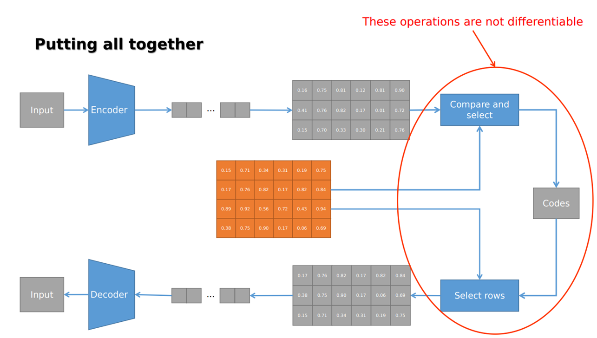

# Response to almost all questions you must know the answers to before attending the exam (questions taken from Galatolo's repository) 

## a. Autograd and SGD

- **a.01** What is the principle behind using Stochastic Gradient Descent (SGD) for optimizing a function w.r.t. its parameters? <br>
    **Response** Dato che il costo computazionale dell'algoritmo del Gradiente Descendente è O(m), man mano che le dimensioni del set di addestramento crescono, il tempo necessario per compiere un singolo passo di gradiente diventa proibitivamente lungo, e quindi si utilizza lo SGD. **L'idea alla base del gradiente stocastico è che il gradiente è un'exepctation.** Nello specifico, ad ogni passo dell'algoritmo, possiamo estrarre casualmente un minibatch di esempi di dimensione m' dal set di addestramento. La stima del gradiente viene formata come segue:
$$\[\hat{g} = \frac{1}{m'} \sum_{i \in m'} \nabla J(\theta; x^{(i)}, y^{(i)})\]$$
L'algoritmo del gradiente stocastico poi segue il gradiente stimato verso il basso:
$$\[\theta_{t+1} = \theta_t - \eta \nabla L(\theta_t; x^{(i)}, y^{(i)})\]$$
Dove eta è il tasso di apprendimento.
L'algoritmo di ottimizzazione non garantisce di raggiungere un minimo locale in un tempo ragionevole, ma spesso trova un valore molto basso della funzione di costo abbastanza rapidamente da essere utile. È il principale modo per addestrare modelli lineari su set di dati molto grandi.

- **a.02** Explain the concept of function composition in neural networks and how it relates to layers in a model.<br>
    **Response**: Il concetto di composizione delle funzioni nelle reti neurali si riferisce alla pratica di combinare più strati (layers) per formare una rete neurale complessa. In una rete neurale, ogni strato è costituito da neuroni e ognuno di questi strati esegue una trasformazione matematica sui dati in input. La composizione di queste trasformazioni attraverso gli strati della rete rappresenta la funzione complessiva che la rete sta apprendendo. Quando diciamo "composizione delle funzioni" in questo contesto, intendiamo che l'output di uno strato diventa l'input per il successivo. Quindi, se hai uno strato f1 seguito da uno strato f2, la composizione di f1 e f2 è f2(f1(x)), dove x è l'input originale.
  Ad esempio, se x rappresenta l'input di una rete neurale, l'output dello strato f1 sarà f1(x), e l'output totale della rete dopo la composizione con f2 sarà f2(f1(x)). Questa composizione di strati permette alla rete neurale di apprendere rappresentazioni più complesse e astratte dei dati. Ogni strato può catturare diversi aspetti o feature dei dati di input, e la composizione di più strati consente alla rete di apprendere rappresentazioni sempre più sofisticate man mano che si sposta attraverso gli strati.

- **a.03 / a.04** How do you calculate the derivative of a composed function w.r.t. its inputs? Describe the unfolding process of a function and its impact on derivative calculation.<br>
    **Response**: Usando la **chain rule**. Cioè usando la moltiplicazione delle derivate parziali (unfolding)
    $$\[\frac{do}{di} = \frac{do}{dw_2} \cdot \frac{dw_2}{dw_1} \cdot \frac{dw_1}{di}\]$$

    Dove:
    - o è l'output.
    - i è l'input.
    - w1 è la funzione più interna
    - w2 la funzione che prende l'output di w1.
    
    L'effetto dell'unfolding è quello di semplificare il calcolo delle derivate, specialmente in contesti in cui le funzioni coinvolte sono intricate.

- **a.06** Explain the derivation process for a function involving a binary operator and how it splits the derivation flow.<br>
    **Response:** In R ogni operatore binario chiuso (4 operazioni di base) creano una somma di due flussi di derivate (pensa alla derivata della somma o del prodotto ad esempio).
- **a.07** What is reverse mode differentiation, and how is it applied to compute derivatives in computational graphs?<br>
    **Response**: Per calcolare la derivata dell'output w.r.t. ad un input devi trovare tutti i possibili percorsi dall'output all'input e moltiplicare i valori parziali su ciascun percorso (ogni percorso corrisponde a una composizione di funzioni) e sommare tutti i risultati (ogni split rappresenta la presenz adi un operatore binario).
    **Nel reverse mode si calcola la derivata parziale di *un output* rispetto ad *ogni input* in passaggio**

- **a.08** Discuss the concept of forward path and backward path in the context of computational graphs and differentiation.<br>
    **Response**: Funziona all'esatto opposto rispetto al reverse mode. **Si calcolano le derivate parziali di *tutti gli output* rispetto a *un input* in un passaggio**.

- **a.09** Describe the differences between forward mode differentiation and reverse mode differentiation in terms of computational efficiency and application.<br>
    **Response**: Il reverse mode è l'ideale quando la dimensione dell'input è molto maggiore di quella dell'output (quindi come capita quasi sempre nel machine learning). Inoltre su ogni ramo abbiamo un solo derivative value.


## b. Tensor algebra and PyTorch

- **b.01** Explain the concept of a tensor in PyTorch. <br>
**Response** Un tensor in PyTorch è un array multi-dimensionale di numeri che generalizza scalari, vettori e matrice.
  
- **b.02** How do the addition and multiplication between tensors work? <br>
   **Response*  <br>
   In PyTorch è possibile fare operazioni tra tensori di dimensioni diverse grazie al broadcasting.
  
- **b.03** What is the difference between the 'reshape' and 'view' methods in tensor manipulation? <br>
  **Response** Entrambe servono per manipolare le dimensione del tensore, ma 'reshape' modifica la dimensione del tensore in memoria (rearrange più lento, ma accesso più veloce), mentre 'view' non cambia la shape in memoria, ma solo l'indexing (acesso più lento ma rearragne più veloce). In pytroch, il rearrange segue il row-major order.
    
- **b.05**/**b.06** Describe the process of creating a custom dataset using 'torch.utils.data.Dataset'. What is the 'torch.utils.data.IterableDataset' and how is it used? <br>
**Response** Per creare un custom Dataset bisogna:
  - creare una classe derivata da torch.utils.data.Dataset
  - implementare i metodi `__init__`,`__len__` e `__getitem__` per creare un dataset che segue il map-model
  - per creare un dataset iterable invece bisogna implementare i metodi `__iter__`, `__next__` che restituiscono rispettivamente `self` e il prossimo data point 
- **b.07** How does the 'torch.utils.data.DataLoader' work in PyTorch? <br>
**Response**: Il Dataloader combina il dataset e il sampler e fornisce un iterable sul dataset (supporta entrambi i tipi di dataset). Utile perchè ha la funzione di automatica batching. Generalmente usato come `torch.utils.data.DataLoader(dataset=ds, batch_size=BATCH_SIZE, shuffle=True)`
- **b.08**/**b.09** Describe the structure and purpose of the 'torch.nn.Module' class. What are the key methods in a PyTorch module, and how are they implemented? <br>
**Response**: Indubbiamente il modulo più importante e alla base della costruzione di reti neurali. Ogni modello ha dei parametri che sono wrappati in un tensore `torch.nn.Parameter`. Alcuni dei moduli già forniti sono `torch.nn.Linear, torch.nn.ReLU. torch.nn.Sequential`. <br> Per creare un modulo custom:
  - creare una classe che eredita da `torch.nn.Module`
  - implementare il metodo `__init__`
  - implementare il metodo `forward(self,input)`. In questo metodo avviene la computazione (il passo forward della rete neurale).
Tra i metodo presenti ricordiamo `parameters` (restituisce un iteratore sui parametri) e `to` (sposta il modulo da device ad un altro, ad esempio da CPU a GPU).
- **b.11** Explain the concept and application of batch size in model training. <br>
**Response**: Meglio utilizzare un sottoinsieme del dataset piuttosto che calcolare la Loss Function (e il gradiente) su tutto il Dataset che può essere molto grande.
- **b.12** How do you implement a simple linear regression model in PyTorch? <br>
   **Response**: Dopo aver creato un Modulo con un unico parametro w, e aver instanziato l'oggetto:
   ```optimizer = torch.optim.SGD(model.parameters(), lr=0.001)
      dl = torch.utils.data.DataLoader(dataset = ds,batch_size=8)
      loss_fn = torch.nn.MSELoss()
      for epoch in range(0, epochs):
         for batch in dataloader:
            y_model = model(batch.input)
            error = loss_fn(y_model, batch.target)
            optimizer.zero_grad()      # per azzerare i gradienti
            error.backward()
            optimizer.step()
   ```

## c. Convolutional Neural Networks and ResNets

- **c.01** What is a CNN? <br>
**Response**: Una Rete Neurale Convoluzionale, nota anche come CNN o ConvNet, è una classe di reti neurali specializzata nell'elaborazione di dati con una topologia a griglia, come ad esempio un'immagine. Il nome "convolutional neural network" indica che la rete utilizza un'operazione matematica chiamata convoluzione. <br>
 Le CNN hanno 3 tipi principali di layer:
- **Convolutional layer**, dove l'operazione di convoluzione tra l'immagine e un kernel viene eseguita
- **Pooling layer**, è un layer opzionale, 
- **Fully-connected (FC) layer**, qui vengono applicate trasformazione lineari al vettore di input attraverso una matrice di pesi. Successivamente, viene applicata una trasformazione non lineare al prodotto tramite una funzione di attivazione non lineare f.
- **c.02** How does the convolution operation work in CNNs? <br>
**Response**: Il kernel "scorre" sull'immagine. Se l'input è un tensore in 3 dimensioni, il kernel è a sua volta di 3 dimensioni, dove l'ultima dimensione deve matchare con quella di input. Dunque se l'Input ha dimensione H x W x D, il kernel avrà dimensione P x Z x D e l'output della convoluzione avrà come dimensione K x T x 1. Se vogliamo avere D come ultima dimensione e non 1, dobbiamo usare D kernel.

- **c.03**/**c.04** Explain the significance of kernel size, padding, and stride in convolutional layers. What are the roles of pooling layers in CNNs? <br>
**Response**: 
- Il padding aggiunge pixel extra intorno all'input, necessario per essere sicuri che la convoluzione processi bene tutto l'input.
- Lo stride si riferisce allo "step-size", cioè di quanti pixel il centro del kernel deve muoversi sull'input.
La dimensione dell'output dipende da questi due fattori (W = kernel size, F = input size): 

Uno strato di pooling è uno strato che applica un'operazione di riduzione su una finestra di scorrimento della convoluzione. Esistono vari tipi di pooling come ad esempio:

Comunque è consigliabile non usare operatori di pooling, dato che avviene una perdita di informazione e hanno una dimensione fissa. Gli operatori di pooling sono sostituibili con un aumento della dimensione del kernel o con l'utilizzo di stride e padding.
- **c.05** Discuss the function of activation functions in CNNs. <br>
**Response** Dato che la convoluzione è un'operazione lineare, fare una composizione di Convolutional Layer sarebbe uguale a eseguire una sola convoluzione, motivo per il quale è necessario inserire funzioni di attivazione non lineari come sigmoid function o ReLU.
- **c.08** What are skip connections in CNNs, and how do they function? <br> 
**Response** Le Skip-connection mitigano il problema del vanishing gradient durante il training della rete. Ovviamente bisogna gestire la somma dell'input con l'output (le dimensioni potrebbero essere diverse)
- **c.09**/**c.10** Define a Residual Network (ResNet) and its advantages in deep learning.Draw a diagram of a ResNet and its computational graph <br>
**Response** ResNet è un architettura di deep learning progettata per allenare very deep NNs introducendo il concetto di residual blocks.

Nota: Nel percorso inferiore non è importante cosa sia la convoluzione, l'importante è che non cambi la shape. Viene eseguita la convoluzione e la batch normalization se la dim di input e quella di output sono diverse.
- **c.12** Describe the architecture of a typical CNN. <br> 
**Response** : Vedi risposta c.1.
- **c.15** Discuss the application of CNNs in image classification tasks, with an example like MNIST. <br>
**Response**: Le reti neurali convoluzionali (CNN) sono ampiamente utilizzate per compiti di classificazione delle immagini. Questo tipo di rete è progettato per catturare pattern spaziali nelle immagini sfruttando l'idea di convoluzione.Nel contesto della classificazione delle immagini, le CNN sono particolarmente efficaci. Il primo strato di una CNN è solitamente un layer di convoluzione. Questo strato applica diversi filtri alle immagini di input, cercando di rilevare diverse caratteristiche come linee, curve, o angoli. Questo processo si ripete attraverso diversi strati di convoluzione. Dopo i layer convoluzionali, viene solitamente aggiunto un insieme di layer completamente connessi per combinare le informazioni estratte e produrre l'output finale di classificazione.

## d. Recurrent Neural Networks

- **d.01** What is a Recurrent Neural Network (RNN), and how does it work? <br> 
**Response** Una RNN è un tipo di NN che applica gli stessi pesi ricorsivamente su un Time-Varying Input per generare un time-variable output. Gli ingressi possono avere lunghezza variabile. Nota importante è che, dato che vengono applicati gli stessi pesi, i parametri vengono condivisi (quindi abbiamo un numero minore di parametri) e che la RNN è in grado di mantenere uno stato interno (una sorta di memoria) il quale viene usato per generare gli output.
- **d.02** Explain the concept of time-varying inputs and outputs in RNNs. <br>
**Response**: 
- Input Time-Varying (Ingressi Variabili nel Tempo): Nei modelli RNN, ogni passo temporale di input è considerato separatamente. Ad esempio, se abbiamo una sequenza temporale di lunghezza T, con input x₁, x₂, ..., xₜ, la RNN elabora questi input sequenzialmente. In pratica, ciò consente alla rete di catturare le dipendenze temporali nei dati, considerando l'ordine in cui gli input sono presentati.
- Output Time-Varying (Uscite Variabili nel Tempo): Allo stesso modo, le uscite di una RNN possono variare nel tempo. Ogni passo temporale produce un'uscita specifica. Questo è particolarmente utile quando si lavora con sequenze di output, come la previsione di un valore in ogni momento successivo in una serie temporale. La rete può imparare a generare output che dipendono dai dati di input precedenti, sfruttando la sua capacità di mantenere una memoria interna delle informazioni passate (hidden state).
- **d.03** Describe two major application families of RNNs: Sequence to Task and Sequence to Sequence.<br>
**Response**:
- Seq2Task: usata principalmente per catturare pattern e dipendenze all'interno di sequenze (usato per classificazione o regressione).
- Seq2seq: Maggiore applicazione nel campo del text-summarization, machine tranlsation e speech2text.
- **d.05** Discuss the vanishing gradient problem in RNNs and its impact on learning from long sequences. <br>
**Response**: Il problema è che dovendo fare la back-propagation della funzione di Loss, dobbiamo fare "l'enroll" del computational graph (come se fossero tanti nodi in maniera sequenziale). Dunque più è lunga la sequenza, più ricorsioni abbiamo, più nodi abbiamo --> il computational graph è più lungo, e dato che l'uscita di ogni stato dipende dal precedente, avremmo una produttoria nel computational graph fattori sempre più piccoli. Dei metodi per provare a mitigare il vanishing gradiente problem sono le LSTM networks e le GRU networks.
- **d.07** What are Long Short-Term Memory (LSTM) networks and how do they address the vanishing gradient problem? <br>
**Response**:


Notes: 
  -	Hidden state possono assumare solo valori tra -1, 1 (è l'output di prodotto tra tanh e outputGate)
  - Output appartiene a [0,1]^h
  - Forget gate: dato che è l'output di una sigmoid function, quando il valore è 0, la memoria è dimenticabile!

- **d.08** What are Gated Recurrent Unit (GRU) networks and how do they differ from LSTMs? <br>
**Response**: simili a LSTM, ma hanno una struttura più semplice con soli 3 gate: reset gate, update gate e new gate.


- **d.10** Explain how to train an RNN for a sequence classification problem.

- **d.11** Discuss the considerations for setting up RNNs, LSTMs, and GRUs for a classification task

## e. Autoencoders and VAEs

- **e.01**/**e.02** What is an autoencoder, and what are its primary components?Describe the roles of the encoder and decoder in an autoencoder. <br>
  **Response**: Un autoencoder è un tipo di rete neural progettata per l'unsupervised learning. è composto da due componenti principali: l'encoder e il decoder. L'obiettivo è quello di imparare una rappresentazione compatta dell'input.<br>
  L'encoder copmrime l'input in una loer-dimension rappresentation (chiamata **Latent space**).  <br>
  Il decoder ricostruisce l'input originale a partire dallo spazio latente.
  
- **e.04**/- **e.05** Discuss the concept of reconstruction error in autoencoders. How does an autoencoder learn a compact representation of input data? <br>
  

- **e.06** What is a denoising autoencoder, and how does it differ from a traditional autoencoder? <br>
**Response**: è una variante del traditional AE. L'obiettivo è quello di imparare una rappresentazione robusta della struttura sottostante, rimuovendo il rumore. Possiamo vedere l'architettura come: <br>

- **e.07** What are Variational Autoencoders, and how do they differ from regular autoencoders? <br>
**Response**: è una variante del traditional AE, il cui obiettivo non è solo imparare una rappresentazione compatta dei dati ma anche quello di **generare nuovi punti a partire dalla rappresentazione imparata**. I VAE usano un **approccio stocastico**.

- **e.08** How does the Reparametrization Trick work? <br>
**Response**: Dato che il random sample non è un'operazione differenziabile, abbiamo bisogno di un trick per poter fare la backpropagation, la base del trick è:
 <br>
L'architettura diventa: <br>
 <br>
**ATTENZIONE: Tieni a mente che mu e sigma sono due parametri che la rete deve imparare!**
- **e.10** Why VAEs are a 'generative' architecture? <br> 
**Response**: perchè la rete imparara una rappresentazione stocastica dei dati.
- **e.11** What is the Kullback-Leibler divergence, and how is it used in VAEs? <br>
La KL divergence è una misura di quanto due distribuzioni di probabilità differiscono. Nel contesto degli AE è usata come **regolarizzazione** durante il **training**: nello specifico, serve per incoraggiare la rete a imparare una **distribuzione multivaraita non correlata**, i.e:

- **e.14** How does the 'Face Swap' algorithm work? <br>


## f. Vector Quantized Variational Autoencoders

- **f.01** What is a Vector Quantized Variational Autoencoder (VQ-VAE)? <br>
**Response**: è un tipo di rete neurale che combina gli aspetti del VAE e la vector quantization in modo da imparare un **rappresentazione discreta** dei dati.

- **f.02**/**f.03** Explain the process of mapping input data to a continuous latent space and then to discrete codes in a VQ-VAE. How does the vector quantization process work in a VQ-VAE, and what is the role of the codebook?
**Response**: la prima cosa da sapere è che il codebook è una matrice di m righe e p colonne (le righe sono i code nel quale i dati vengono quantizzati). <br>
 <br>
La rappresentazione continua in uscita dall'encoder viene riorganizzata in una matrice che ha lo stesso numero di colonne del notebook (p) e come numero di righe il numero di codice desiderati per l'encoding (k). Il processo di quantizzazione è il seguente: 
  - Per ogni vettore output dell'encoder si calcola la distanza rispetto a ogni codice del codebook
  - Il risultato viene memorizzato in una matrice
  - Per ogni riga, viene scelto l'argmin, il quale sarà l'indice del codebook. <br>
  L'immagine riassume il processo di quantizzazione, mostrando però il codebook trasposto:
   <br>
- **f.04** How does the quantization trick work? <br>
**Response**: Per quanto visto fino ad ora l'archiettettura risulta:
   <br>
  Si utilizza il seguente trucco '(q-x).detach() + x' in modo tale da staccare la parte del grafo computazionale che arriva a q (non è differenziabile), ma riaggungendo x in mdo tale da non perdere informazione. Sostanzialmente stiamo prendendo dq e viene copiato in dx: è matematicamente sbagliato, ma funziona quando q e x hanno valori molto vicini (che è il nostro obiettivo). Per questo motivo, inizialmente i VQ-VAE sono instabili, dato che q e x non posseggono valori vicini tra loro durante i primi passi dell'allenamento.
   
- **f.06** Describe the function of the 'cdist' function in PyTorch in the context of VQ-VAEs. <br>
**Response**: la funzione cdist calcola la distanza tra due matrici. Vedi risposta a *f.03* per la sua utilità (quantization process)
- **f.07** What is the responsibility of the decoder in a VQ-VAE, and how does it utilize discrete codes for data reconstruction or generation? <br>
**Response**: Il decoder seleziona le righe dal codebook, dati i codice che riceve in ingresso.
- **f.08** Discuss the types of losses used in training a VQ-VAE, specifically reconstruction, codebook, and commitment loss. <br>
**Response**: 
  - **Reconstruction loss**: Serve per addestrare il modello (encoder and decoder) a ridurre al minimo la discrepanza tra i dati di input originali e i dati di output ricostruiti
   - **Codebook loss**: Serve per addestrare il codebook ad avere vettori più vicini a quelli prodotti dal codificatore
   - **Commitment loss**: Serve per addestrare il codificatore a produrre vettori più vicini a quelli del codebook, assicurando che la rappresentazione latente di ogni punto dati sia fortemente associata a una singola voce del codebook. <br>
   Un modo di usarle è: loss = (&alpha;) * Reconstruction error + (&beta;) * (commit + codebook)

## g. Generative Adversarial Networks

- **g.01** What are Generative Adversarial Networks?
- **g.02** Describe the architecture of GANs, including the roles of the generator and discriminator.
- **g.03** Explain how the discriminator functions as a binary classifier in GANs.
- **g.04** Outline the steps involved in training the discriminator in a GAN.
- **g.05** Explain the training process of the generator in a GAN.
- **g.06** Draw a diagram of a GAN and its computational graph
- **g.07** What is an Auxiliary Classifier GAN (ACGAN), and how does it differ from standard GANs?
- **g.08** Discuss the challenges in training GANs and strategies to overcome them.
- **g.09** Describe the process of training a Deep Convolutional GAN (DCGAN) on the MNIST dataset.
- **g.10** How can the balance between randomness and class information be maintained in an ACGAN?

## h. Advanced Architectures

- **h.01** What is YOLO (You Only Look Once) in the context of object detection, and how does it perform real-time detection?
- **h.02** Explain how YOLO divides an image into a grid for object detection and how it predicts bounding boxes and class probabilities.
- **h.03** Describe Non-Maximum Suppression (NMS) and its role in object detection.
- **h.04** What is Faster R-CNN, and how does it combine a Region Proposal Network (RPN) with a CNN?
- **h.05** Explain the U-Net architecture and its application in semantic image segmentation.
- **h.06** What is CLIP (Contrastive Language-Image Pretraining) by OpenAI, and how does it combine vision and language?
- **h.07** Discuss Denoising Diffusion Probabilistic Models (DDPM) and Latent Diffusion, and their role in generating high-quality samples.
- **h.08** Describe the DALL-E 2 architecture
